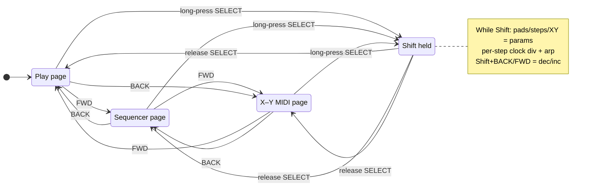

# Sequencer page & Shift modifier — future UX spec

This document specifies a **planned** feature set (partially scaffolded in firmware):

- **Done (UI shell):** `Screen::Sequencer`, 16-cell grid, step picker dropdown (surround chords + tie + rest + `S?` surprise), NVS/SD for pattern + `SeqExtras`, live playhead highlight, and internal transport-driven MIDI step output (chord/rest/tie/surprise) for active lane. **`Screen::XyPad`** touch pad + CC storage. **Bezel ring** (short tap BACK/FWD): **Transport → Play → Sequencer → X–Y** (cyclic). Internal **transport** (speaker metronome, playhead, count-in) — **not** full MIDI clock I/O yet.
- **Not done:** spec **Shift** layer (long-press SELECT for params — distinct from Play **key-edit latch** on SELECT), **clock division**, **per-step arpeggiator**, assignable X–Y **MIDI** (14-bit, release policy, editor), **Shift+BACK/FWD** parameter nudge.

Full target behavior: a **4×4 beat grid** step sequencer, **bezel-based paging** among main surfaces, and a **Shift** layer (long-press **SELECT**) that remaps chord pads and step cells to **MIDI parameter / program-change** controls, with **Shift+BACK/FWD** for incremental edits and accelerated holds.

**Audio playback**, **expanded NVS/SD** (per-step arp + divisions), **dropdown editor**, and **Shift** are not implemented yet; audible playback depends on **MIDI OUT** (see Milestone 3 in `DEV_ROADMAP.md`) and **internal or external clock**.

---

## Goals

1. **Sequencer page**: one screen showing **4 bars × 4 beats** (16 steps). Each step can hold a **chord** (from the current key’s available harmony), a **rest**, or a **tie** to the previous sounding step.
2. **Step edit**: **tap a step** → open a **dropdown / picker** listing **chords available in the current key** (derived from `ChordModel` for the active tonic/mode), plus **Rest** and **Tie**.
3. **Paging**: **BACK** and **FWD** soft bezel buttons switch between the **chord play surface** and the **sequencer** (and possibly additional pages later). This is the **primary** meaning of BACK/FWD when not in Shift and not performing other chord gestures.
4. **Shift**: **long-press SELECT** acts as a **modifier** (“Shift”). While Shift is active, **chord pads** and **sequencer steps** show **alternate labels** and send **parameter changes** or **program changes** instead of their normal note/chord meanings.
5. **Shift + BACK/FWD**: **tap** = nudge a parameter by one step; **Shift + hold BACK/FWD** = repeat at an accelerating rate (faster adjustment).
6. **Clock division (Shift on sequencer)**: At least one Shift function on **sequencer steps** adjusts **per-step clock division** relative to transport (see **§ Clock division**).
7. **Arpeggiator (per-step)**: Any step may enable an **arpeggiator** with its own **pattern** and **clock division**, independent of other steps (see **§ Arpeggiator**).
8. **X–Y MIDI page**: A dedicated **two-axis touch surface** sends **continuous MIDI** (typically **CC**) on **freely assignable** parameters — e.g. filter cutoff / resonance, FX send, macro controls (see **§ X–Y MIDI control page**).

---

## Screen & page model

| Page | Role |
|------|------|
| **Play** | Current 3×3 layout: key center + 8 surround chords, heart mechanic, key picker combo. |
| **Sequencer** | 4×4 grid + transport/position indicators (exact chrome TBD). |
| **X–Y** | Full-screen (or large) **pad**: horizontal axis = **parameter A**, vertical axis = **parameter B**, user-assignable to MIDI destinations (CC, channel). |

**BACK / FWD** (bezel) **cycle** among main control pages in a fixed ring. **Firmware today:** **Transport → Play → Sequencer → X–Y** (then wraps). Order must stay **discoverable** in UI (hint line / indicators).

**Conflict avoidance**: Other gestures that use the bezel must stay unambiguous:

- **Settings entry** (today): **hold BACK + FWD** ~800 ms — from **Transport, Play, Sequencer, X–Y** (and other surfaces that register the gesture).
- **Play**: **SELECT** tap toggles **key-edit latch**; tap center to open **Key & mode** picker. Spec **Shift** (long-press SELECT) is **not** implemented yet — product must reconcile latch vs Shift when Shift lands.

---

## Sequencer grid (16 steps)

- **Layout**: **4 beats per bar × 4 bars** → **16 cells** in reading order (bar 1 beats 1–4, bar 2 beats 1–4, …).
- **Per-step value** (conceptual model):
  - **Chord**: index into the **current key’s chord set** (same semantic pool as the play surface: `ChordModel` surround slots + consistent naming; optionally include a dedicated “tonic” entry if distinct from slot I).
  - **Rest**: no new attack; output silence or note-off per policy.
  - **Tie**: **no new attack**; **extend** the sounding harmony from the previous **non-rest** step (MIDI: hold notes / legato; ties across rests TBD — default: tie only extends from last pitched step).

- **Tap**: open **dropdown** with all **selectable chords for the current key** + **Rest** + **Tie**.
- **Visual**: compact labels (abbreviations); active step during playback highlighted (implementation detail).

---

## X–Y MIDI control page

A **separate page** from Play and Sequencer: a **single 2D control surface** (X and Y) that maps touch position to **MIDI control** in real time. Intended for **performance** parameters that are not chord steps — **filter cutoff**, **resonance**, **FX send level**, **macro** amounts, **any CC** the user assigns.

### Behavior

- **Touch / drag**: Pointer position **(x, y)** normalized to the pad bounds maps to **two independent control streams** (e.g. **CC 74** brightness left–right, **CC 71** resonance bottom–top).
- **Release**: Optional policies — **hold last value**, **spring to center** (default position), or **send all-notes-off / CC default** — **TBD** per destination.
- **Resolution**: Prefer **14-bit** where supported (**MSB/LSB** pairs for the same CC, or NRPN) for smooth sweeps; **7-bit CC** acceptable for v1.

### Assignment (free mapping)

Each axis is **independently configurable**:

- **MIDI channel** (1–16, or follow **global out channel** from settings).
- **Control**: **CC number** (0–127), or **NRPN** / **RPN** if added later.
- **Optional curve**: linear, **log** (for frequency-like feels), **inverted** axis.

**Labels**: User-editable short names on-screen (e.g. `Cutoff`, `Reso`, `DelaySend`) stored in NVS so the pad reflects **current** routing.

**Shift / long-press on X–Y page (optional)**: **Tap-hold** or **Shift** could open an **assignment editor** for axis A/B without leaving the page (or use **Settings** sub-page — TBD).

### Data model (conceptual)

- `xyAxisA`: `{ channel, cc, invert, curve }`
- `xyAxisB`: same
- `xyPadSpring`: enum `Hold | Center | Zero`
- Optional: **preset slots** (save/recall pairs of assignments).

### MIDI & persistence

- Depends on **MIDI OUT** (Milestone 3).
- **NVS + SD backup** should include X–Y assignments when the rest of the schema migrates.

---

## Shift modifier

### Activation

- **Long-press SELECT** (duration TBD, likely **400–800 ms**; may reuse timing constants from settings-entry gesture code).
- **Mode**:
  - **Hold-to-Shift (recommended v1)**: Shift is **true while SELECT is held**; releasing SELECT exits Shift. Predictable and matches “modifier” mental model.
  - **Toggle Shift (optional)**: double-tap or tap-hold-release; can be added later if needed.

While **Shift is active**:

- **Chord pads** (Play page): labels switch to **parameter or program-change targets** (e.g. CC numbers, bank/program pairs). **Tap** sends the mapped MIDI message (once implementation exists).
- **Sequencer steps**: same 16 cells show **alternate parameters** (see **§ Shifted step functions** below). **One** of these Shift functions is **clock division** (see **§ Clock division**).

### Shifted step functions (sequencer)

When **Shift** is held, a **tap** on a step does **not** choose chord/rest/tie; it adjusts **step metadata**. Recommended set (v1 — final list TBD):

| Function | Purpose |
|----------|---------|
| **Clock division** | Sets how that step’s time is subdivided relative to the **transport clock** (see below). Can apply to **straight chord hits** or to the **arpeggiator** when enabled on that step. |
| **Arpeggiator on/off** | Enables or bypasses the arp for this step only. |
| **Arp pattern** | Chooses the **note order** within the chord voicing (see **§ Arpeggiator**). |
| **Arp clock division** | Subdivision for **arp notes** (may match or differ from the step’s main clock division). |
| *(Optional later)* Velocity / probability / accent | Extra per-step performance params. |

**UX**: Either **cycle** categories with **Shift+tap** (same step repeatedly) or a **small overlay** listing the four fields for the touched step. **Shift+BACK/FWD** nudges the **focused** field (last touched) or the **global** clock context — product decision (see open questions).

### Shift + BACK / FWD

- **Shift + tap BACK**: decrement focused parameter (or coarse step).
- **Shift + tap FWD**: increment focused parameter.
- **Shift + hold BACK** or **Shift + hold FWD**: **repeat** the decrement/increment at increasing rate (debounce + acceleration curve TBD).

**Focus model**: One “focused” parameter at a time (e.g. last touched pad/step, or explicit focus cycling — TBD).

---

## Clock division

**Clock division** answers: “How many **substeps** fit inside one **sequencer step** (one cell in the 4×4 grid) for timing purposes?” It is **not** the same as BPM; BPM sets the **quarter-note** rate of the transport, while division sets **musical subdivision** of each step.

### Global vs per-step

- **Global default**: A **project- or session-level** division (e.g. “each step = one quarter note” vs “each step = one eighth note”) may exist in **transport settings** (roadmap: Milestone 2 / transport row).
- **Per-step (Shift)**: Any step can override **its** division so one pattern can mix, for example, **whole-step** hits on downbeats and **faster** subdivisions elsewhere. **At least one** Shift path on the sequencer grid must expose **clock division** editing (per-step).

### Example discrete values (implementation)

Illustrative set; exact list and naming in firmware TBD:

- **1** (one pulse per step — step equals one grid tick at base rate)
- **1/2**, **1/4**, **1/8**, **1/16** of the **step window** (meaning: number of internal clock ticks consumed by that step’s content)
- **Triplet** variants (e.g. **1/8T**) optional phase-2

**Interaction with arp**: If a step has **arpeggiator enabled**, **arp clock division** controls how fast notes **inside** the chord cycle, which may be **tighter** than the step’s outer division (e.g. step = quarter, arp = sixteenths).

---

## Arpeggiator (per-step)

The **arpeggiator** breaks a **chord step** into a **sequence of MIDI note-ons** according to a **pattern** and a **clock division**, **independently for each of the 16 steps**.

### When it applies

- **Chord steps only**: If the step is **Rest** or **Tie**, arp is **inactive** (or forced off in UI).
- **Per-step**: Step *i* can have arp **on** with pattern **P** and division **D**, while step *j* is a **straight** chord hit with no arp. This is a **hard requirement**: arp is **not** only a global mode.

### Arp patterns (illustrative)

| Pattern | Behavior |
|---------|----------|
| **Up** | Low note → high within the voicing |
| **Down** | High → low |
| **Up–down** | Up then down without repeating top/bottom (or with — TBD) |
| **Down–up** | Mirror |
| **Random** | Random order, re-seeded per step trigger or per loop (TBD) |
| **As played** | Order notes were entered (if chord entry ever supports voicing order) |
| **Outside-in** | Alternating from ends |

### Arp clock divisions

Same **family** of values as **§ Clock division**, but scoped to **sub-notes** within the step: e.g. **1/8** arp under a **1/4** step yields **two** arp notes per step window (if they fit; **note stealing** / **truncate** policy TBD).

### Data model (conceptual)

For each step index `0..15` store at minimum:

- `content`: chord index / rest / tie (existing).
- `stepClockDiv`: override for **this step’s** timing window (optional; inherit global if unset).
- `arpEnabled`: bool.
- `arpPattern`: enum (Up, Down, …).
- `arpClockDiv`: subdivision for arp notes.

**NVS / SD backup**: Extends the flat 16-byte pattern blob — requires **schema version** and migration (see Milestone 2).

---

## MIDI & data dependencies (non-UI)

- **Playback**: requires **MIDI OUT** and a **clock** (internal BPM and/or external MIDI clock — see `docs/MIDI_INPUT_SPEC.md`).
- **Persistence**: store at least one **16-step pattern** (+ key reference or store relative indices) in NVS; **schema versioning** when adding sequencer blobs (see Milestone 2 migration item).
- **Safety**: **all-notes-off** / panic on page change and mode transitions (roadmap item).

---

## Open questions (to resolve before implementation)

1. **Paging vs bar navigation**: If the grid ever needs **multiple patterns** or **scroll within 16 steps**, do BACK/FWD mean **page** vs **bar**? This spec assumes **one** 16-step view; extra depth may use **Shift+** or a secondary row of controls.
2. **Tie across bar line**: Allowed; semantics for “previous chord” at bar 1 beat 1 (wrap from end of loop or none).
3. **Surprise / heart chords in seq**: In or out of dropdown v1 — default **diatonic/surround only**; borrow pool optional.
4. **Program change vs CC**: Exact mapping table for 8 pads × Shift (GM, user bank, or CC-only).
5. **Global vs per-step clock**: If **global BPM** and **global default division** exist, define **precedence** when a step sets its own division (override vs scale).
6. **Arp note count vs step length**: If **more arp notes** than fit in the step window, **truncate**, **spill** into next step, or **compress** timing — pick one policy.
7. **Shift focus**: Whether **Shift+BACK/FWD** adjusts **global** clock, **last step’s** arp fields, or **last touched** metadata field.
8. **X–Y release policy**: **Hold** last CCs, **spring** to center (and send matching values), or **zero** — may differ per axis.

---

## Suggested implementation order

1. **MIDI OUT** + single-channel note output from existing chord taps (Milestone 3).
2. **Sequencer UI shell**: new `Screen::Sequencer`, 16-cell grid, NVS load/save stub, no audio.
3. **Step dropdown** wired to `ChordModel` names + rest/tie.
4. **Transport** (internal BPM) + step advance + MIDI from pattern.
5. **Bezel paging** Play ↔ Sequencer + gesture arbitration with settings / key picker.
6. **Shift** (long-press SELECT) + remapped pad/step labels + MIDI CC/program mapping.
7. **Shift + BACK/FWD** incremental + hold-accelerate.
8. **Per-step clock division** in Shift (including wiring to transport math).
9. **Per-step arpeggiator** state machine: patterns + arp divisions + MIDI note scheduling from chord voicings.
10. **Schema migration** for expanded pattern blob (settings + seq + per-step arp/div).
11. **`Screen::XyPad`** (or equivalent): touch mapping, dual CC (or 14-bit) output, assignment UI, NVS for axis routing + labels.

---

## Diagram: modifier and pages (conceptual)

---

## Related documents

- `docs/DEV_ROADMAP.md` — milestones; sequencer items added under **Milestone 6**.
- `docs/MIDI_INPUT_SPEC.md` — transports, clock, BPM UI.
- `docs/ORIGINAL_UX_SPEC.md` — baseline play UX.
